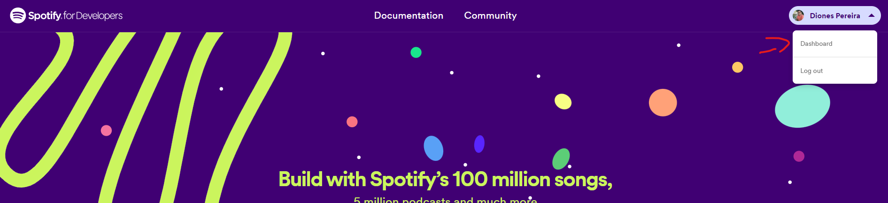
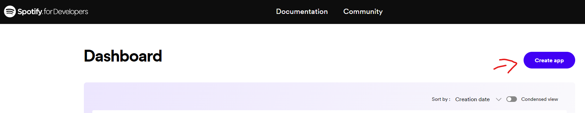
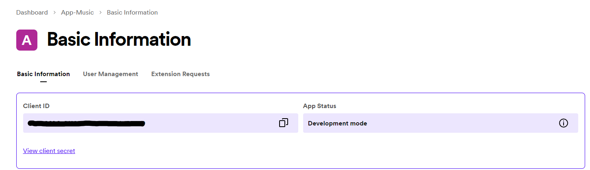
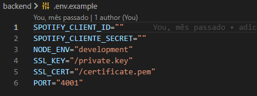
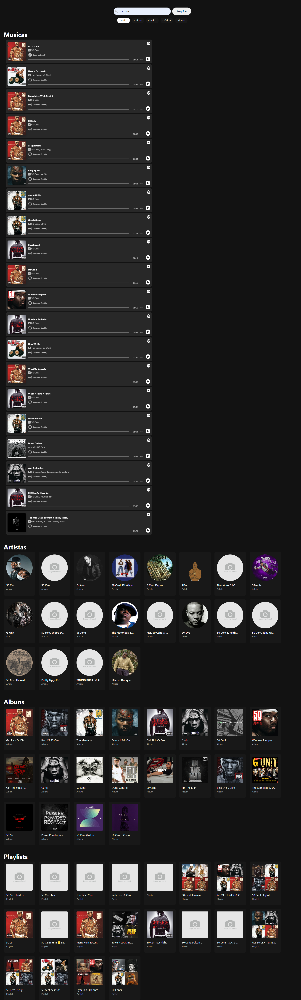
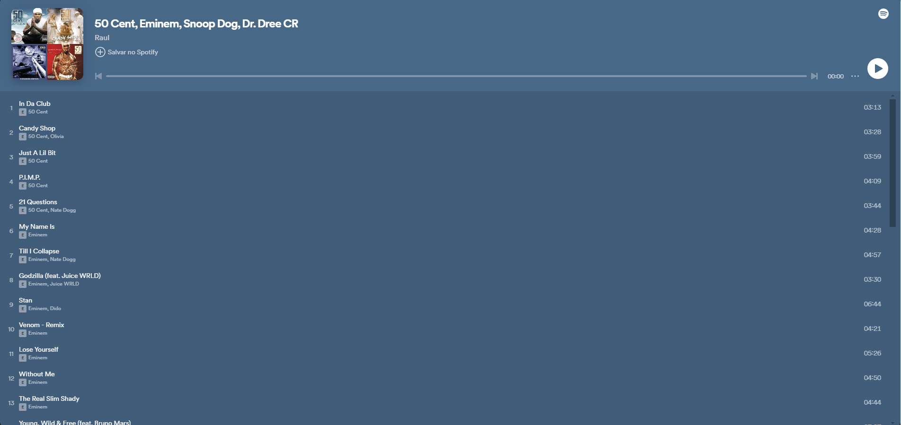

## App spotify para conculta de músicas, playlists, artistas e albums

Esta app tem como finalidade retornar músicas, playlists, artistas e albums do resultado da pesquisa na tela inicial, com isso é prossível reproduzir músicas de seu artista ou banda favorita diretamente na tela do seu navegador sem precisar acessar o aplicativo do spotify, este projeto foi dividido em backend e Front-End.

## Instalação

Para rodar o projeto deve ter instalado o Node JS e o NPM e além disso fazer um cadastro de aplicativo no site oficial do [desenvolvedor do spotify](https://developer.spotify.com/):

#### 1. Na tela inicial do link acima você deve estar conectado a sua conta do spotify, então clique em Dasboard:

#### 2. Na Próxima tela cliquem em Create app:

#### 2. Após preenchear as informações do seun novo app irá aparecer na listagem da tela de Dasboard o seu app, clicando nele vai aparecer um botão ao lado chamado Settings, na próxima tela vai aparecer as informações de Client ID e Cliend Secret:

#### 2.1 Essas informações de Client ID e Cliend Secret devem ser inseridas no arquivo .env



Após configurar o projeto seguindo os passo acima, rode os comandos abaixo:

```bash
  cd back-end
  npm install 
  start:dev
  -------------
  cd front-end
  npm install 
  npm run start
```

## Telas do Front-End
Abaixo estão as telas implementadas no front-end com React JS para consumir a API:

#### Tela Home
Nesta tela você pode pesquisar a musica, album, artista ou playlists, ao pesquisa sem clicar em nenhuma tag é listado todos os dados da pesquisa, como as músicas, artista, albums e playlist, se quiser listar por exemplo só os albums é só clicar no botão 'Álbums' e em pesquisar que irá listar apenas os albums relacionado a pesquisa o mesmo acontece para as outras opções:



#### Tela de playlist
Ao clicar em algum card na listagem de playlist será redirecionado para esta tela onde irá exibir uma playlist de musica do artista pesquisado anteriormente, o mesmo acontece se clicado em um card de albums, será redirecionado para uma lista onde irá lista as músicas do album selecionado.



## Stack utilizada

**Back-end:** Node, Express, Typescript, Axios, Cors, Dotenv, [SDK da api do spotify](https://developer.spotify.com/blog/2023-07-03-typescript-sdk) 

**Front-end:** React, [Material UI](https://mui.com/material-ui/), [Axios](https://axios-http.com/ptbr/docs/intro), [React Router Dom](https://reactrouter.com/en/main)

## 🚀 Sobre mim
Eu sou uma pessoa desenvolvedora full-stack, usando as tecnologias Node JS no Back-end e React no Fron-end, API Restfull e estudando outras tecnologias interessantes e em alta no mercado.

## 🛠 Habilidades
Javascript, HTML, CSS, Node JS, PHP, Spring Boot, Mongo DB, React...

## 🔗 Links
[](https://github.com/Diones25)
[](https://www.linkedin.com/in/diones-pereira-alves-31bb3969/)


